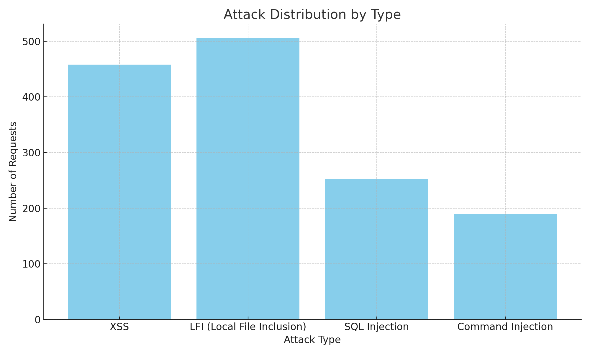
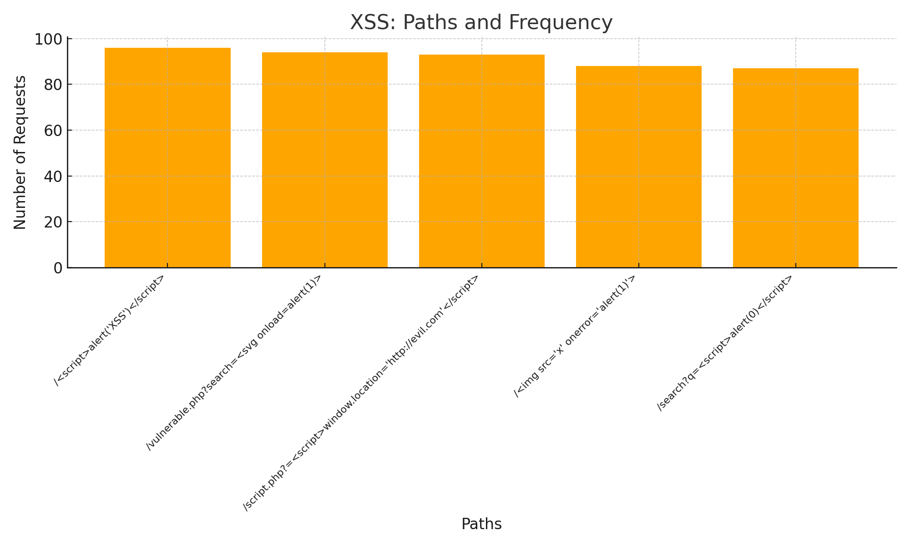
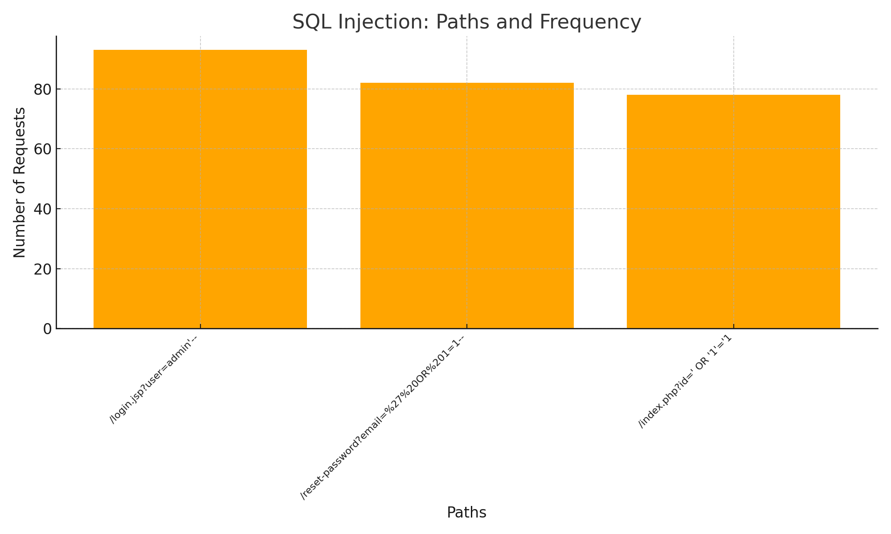
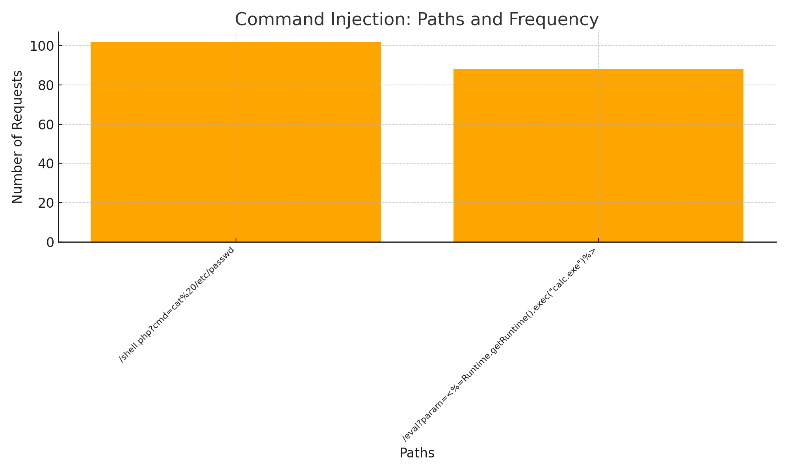

# Response-HomeWork

## Introduction
This report presents a network traffic analysis aimed at identifying and classifying potential cybersecurity threats. The data was collected and categorized based on detected malicious behaviors.

---

## Data Summary
- **Total number of analyzed IPs:** 18589
- **Number of IPs marked as malicious:** 452
- **Total number of requests in the dataset:** 30000

---

## List of Countries Accessing the Environment

**Access Distribution by Country:**

- in: 18372 accesses
- us: 11481 accesses
- br: 37 accesses
- jp: 34 accesses
- gb: 26 accesses
- fr: 20 accesses
- cn: 10 accesses
- de: 8 accesses
- au: 8 accesses
- ca: 4 accesses

---

## Parallel between Malicious Requests and Countries

**Distribution of Malicious Requests by Country:**

- in: 1069 malicious requests
- us: 717 malicious requests
- de: 2 malicious requests
- gb: 2 malicious requests
- au: 1 malicious request
- br: 1 malicious request
- fr: 1 malicious request

---

## Highlighted IPs

### General Attack Distribution by Type

### Detailed Charts by Attack Type
#### XSS

#### LFI (Local File Inclusion)
_details_en.png)
#### SQL Injection

#### Command Injection

---

## Identified Attacks

### 1. XSS (Cross-Site Scripting)
**Total Requests:** 458  
**Identified Paths:**
- `/ `: 96 times
- `/vulnerable.php?search=<svg onload=alert(1)>`: 94 times
- `/script.php?=`: 93 times
- `/ `: 88 times
- `/search?q=`: 87 times

---

### 2. LFI (Local File Inclusion)
**Total Requests:** 506  
**Identified Paths:**
- `/../../../windows/win.ini`: 115 times
- `/../../../../windows/system32/cmd.exe`: 106 times
- `/../../../../../../../../../../etc/shadow`: 103 times
- `/../../../etc/passwd`: 102 times
- `/../../boot.ini`: 80 times

---

### 3. SQL Injection
**Total Requests:** 253  
**Identified Paths:**
- `/login.jsp?user=admin'--`: 93 times
- `/reset-password?email=%27%20OR%201=1--`: 82 times
- `/index.php?id=' OR '1'='1`: 78 times

---

### 4. Command Injection
**Total Requests:** 190  
**Identified Paths:**
- `/shell.php?cmd=cat%20/etc/passwd`: 102 times
- `/eval?param=<%=Runtime.getRuntime().exec("calc.exe")%>`: 88 times

---

## Mitigation Recommendations

### 1. XSS (Cross-Site Scripting)
- **Sanitize Input:** Implement input sanitization in forms and URL parameters.
- **Content Security Policy (CSP):** Restrict the loading of external scripts.
- **Encode Output:** Always encode data before displaying it in the browser.

### 2. LFI (Local File Inclusion)
- **Path Validation:** Restrict path parameters to allow only specific locations.
- **Disable Verbose Errors:** Avoid exposing detailed error messages.
- **Input Sanitization:** Remove characters like `../` and validate path inputs.

### 3. SQL Injection
- **Prepared Statements:** Use parameterized queries to prevent SQL injection.
- **Input Validation:** Restrict user input to expected types and values.
- **Monitoring:** Set up alerts to detect anomalous query patterns.

### 4. Command Injection
- **Restrict Commands:** Avoid executing system commands directly from user inputs.
- **Input Validation:** Strictly limit the types of data allowed as input.
- **Isolation:** Run critical processes in containers or isolated environments.

### 5. Country Access Control
- **Country Whitelisting:** Configure firewall policies to allow only relevant countries.
- **Geoblocking:** Automatically block accesses from disallowed regions using IP geolocation.
- **Continuous Monitoring:** Log and analyze accesses from unauthorized countries to adjust policies as needed.

### 6. Use of a WAF (Web Application Firewall)
- **Custom Rule Configuration:** Set up rules to block specific attacks, such as XSS, SQL Injection, and LFI.
- **Automated Protection:** Enable features like traffic inspection and bot prevention.
- **Log Integration:** Use the WAF to collect and monitor traffic data in real-time for rapid incident response.

---

## Conclusion
The analysis highlighted IPs and paths representing potential security threats, categorized into different attack types. Implementing the proposed recommendations will help mitigate risks, improve security posture, and ensure compliance with company policies.
