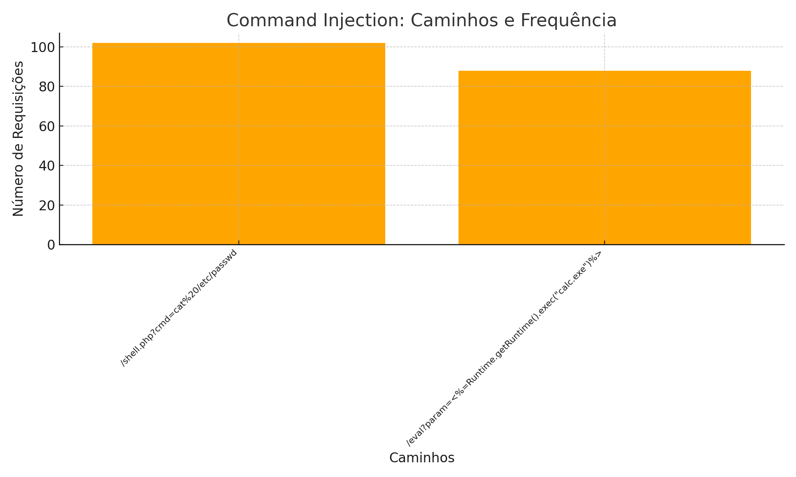

# Resposta-HomeWork

## Introdução
Este relatório apresenta uma análise de tráfego de rede com o objetivo de identificar e classificar possíveis ameaças de segurança cibernética. Os dados foram coletados e categorizados com base em comportamentos maliciosos detectados.

---

## Sumário de Dados
- **Número total de IPs analisados:** 18589
- **Número de IPs marcados como maliciosos:** 452
- **Total de requisições no dataset:** 30000

---

## IPs Destacados
### Distribuição Geral de Ataques por Tipo

### Gráficos Detalhados por Tipo de Ataque
#### XSS

#### LFI (Local File Inclusion)
_details.png)
#### SQL Injection

#### Command Injection

---

## Lista de Ataques Identificados
### 1. XSS (Cross-Site Scripting)
**Total de Requisições:** 458  
**Caminhos Identificados:**
- `/ `: 96 vezes
- `/vulnerable.php?search=<svg onload=alert(1)>`: 94 vezes
- `/script.php?=`: 93 vezes
- `/ `: 88 vezes
- `/search?q=`: 87 vezes

---

### 2. LFI (Local File Inclusion)
**Total de Requisições:** 506  
**Caminhos Identificados:**
- `/../../../windows/win.ini`: 115 vezes
- `/../../../../windows/system32/cmd.exe`: 106 vezes
- `/../../../../../../../../../../etc/shadow`: 103 vezes
- `/../../../etc/passwd`: 102 vezes
- `/../../boot.ini`: 80 vezes

---

### 3. SQL Injection
**Total de Requisições:** 253  
**Caminhos Identificados:**
- `/login.jsp?user=admin'--`: 93 vezes
- `/reset-password?email=%27%20OR%201=1--`: 82 vezes
- `/index.php?id=' OR '1'='1`: 78 vezes

---

### 4. Command Injection
**Total de Requisições:** 190  
**Caminhos Identificados:**
- `/shell.php?cmd=cat%20/etc/passwd`: 102 vezes
- `/eval?param=<%=Runtime.getRuntime().exec("calc.exe")%>`: 88 vezes

---

## Conclusão
A análise destacou IPs e caminhos que representam potenciais ameaças de segurança, categorizados em diferentes tipos de ataques. Este relatório pode servir como base para ações de mitigação e monitoramento contínuo.

---

## Lista de Países que Acessaram o Ambiente

**Distribuição de Acessos por País:**

- in: 18372 acessos
- us: 11481 acessos
- br: 37 acessos
- jp: 34 acessos
- gb: 26 acessos
- fr: 20 acessos
- cn: 10 acessos
- de: 8 acessos
- au: 8 acessos
- ca: 4 acessos
